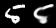
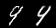
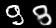
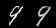
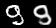

# Incorporating class information into VAE (VAE-with-class)
Personal Project by Zoey CuiZhu

<h2>Task</h2>
An alternative formulation of VAE with class information applied to MNIST data so that generative output is human-readable and the correct number as compared to outputs from the unmodified VAE. This VAE-with-class is not CVAE (conditional VAE https://papers.nips.cc/paper_files/paper/2015/hash/8d55a249e6baa5c06772297520da2051-Abstract.html) or supervised learning with VAE. Main modification is in the loss function such that each class induces a separated Gaussian in embedding space.

<h2>Preliminary Results</h2>
Outputs from unmodified VAE: left is the input test image, right is the paired VAE output

   

Outputs from VAE-with-class: left is the input test image, right is the paired VAE output  
   

As shown in the examples, outputs from unmodified VAE may look like other numbers such as 9->4 and 9->3 for the rightmost two. Adding class information (perhaps unsurprisingly) shows an improvement in human readability and correctness of the outputs. In addition, the leftmost two numbers also look more readable using VAE-with-class (a bigger gap in the bottom part of 5 and left part of 3 is unconnected). Further experiments include applying this to more complex datasets as well as changing the network at test time so that the class label is inferred in unsupervised way from the input image and the output is drawn from a distribution according to the inferred class (with hopefully the same improvements in readability).